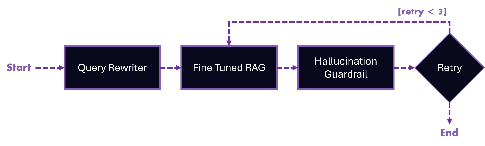
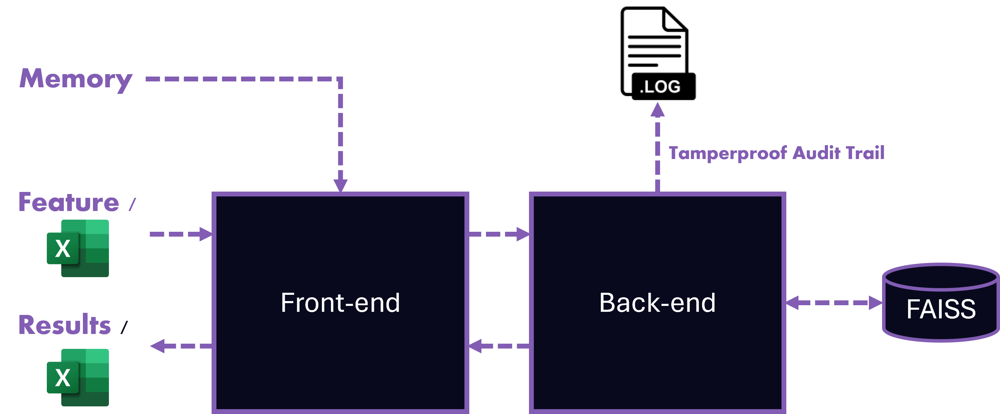
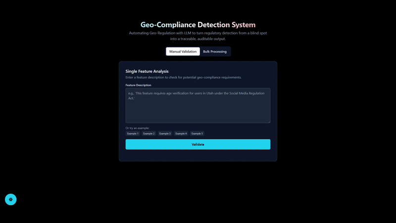

# Bits-Bytes

# About
This project implements a Retrieval-Augmented Generation (RAG) pipeline using FastAPI for the backend and React for the frontend. The backend handles document processing, question answering, and integrates with various language models and vector stores. The frontend provides a user interface for interacting with the backend services.

## Solution Overview

[](./assets/pipeline.png)
[](./assets/overview.png)

### Retrieval-Augmented Generation (RAG) Pipeline
In order to provide accurate and contextually relevant answers to user queries, we have implemented a Retrieval-Augmented Generation (RAG) pipeline.

The RAG pipeline documents consist of several types of documents:
* Legal documents (e.g., regulations, laws)
* Business documents (e.g., company-specific terms/jargon)

The documents are processed and indexed using FAISS, a popular vector store, to enable efficient retrieval based on semantic similarity.

### Models
We decided to use Qwen3-8B as our main LLM model for generation (the largest model we could load locally). This model was finetuned on a custom dataset to better handle domain-specific queries. The finetuning process involved:
* Generating synthetic data using Gemini 2.5 Flash

This attempts to perform supervised fine-tuning (SFT) and knowledge distillation (KD) to enhance the model's performance on specific tasks by learning from high-quality data and a teacher model.

### Pydantic
By using Pydantic, we are able to ensure the output of the LLM is structured and adheres to a predefined schema. This greatly helps in parsing and utilising the generated content effectively.

### Pre and Post Guardrails
#### Query Rewriting
To ensure that user queries are well-formed and relevant, we implemented a query rewriting step using Ollama's LLM. This step reformulates the user's question to improve clarity and context before passing it to the retrieval and generation components. This helps in reducing ambiguity and enhancing the quality of the retrieved documents.

#### Hallucination Check
To mitigate the risk of hallucinations in the generated responses, we incorporated a hallucination check step. This step evaluates the generated answer against the retrieved documents to ensure factual accuracy. If the confidence score of the answer is below a certain threshold, the system flags it for review or requests additional information.

It will retry the generation step up to 3 times if the hallucination confidence is below the threshold.

### Audit Ready Transparency
To maintain transparency and accountability, we log all interactions with the RAG pipeline. This includes:
* User queries (timestamp, feature, feature description, answer)

Since the log cannot be tampered with by users, it provides an audit trail for all interactions, which is crucial for compliance and review purposes.

### Single and Batch Processing
The RAG pipeline supports both single-question answering and batch processing of multiple queries. This flexibility allows users to efficiently handle large volumes of questions, making it suitable for various applications.

Users would also be able to verify single features without having to upload a CSV file.

### Memory Integration
By allowing users to provide additional context or memory, the RAG pipeline can generate more informed and relevant answers.

The pipeline can be improved by users without having to retrain or modify the model.

# Technologies Used
## Frontend
* React
* Tailwind CSS

## Backend
* FastAPI
* LangGraph
* Ollama
* Pydantic
* FAISS
* Qwen
* NOMIC

## Finetuning
* PyTorch
* Unsloth (Transformers, BitsAndBytes, etc.)
* Qwen

## Development tools
* Visual Studio Code
* Git
* Linux
* Windows
* WSL2

## API and Assets
* Gemini 2.5 Flash - used to generate synthetic data for finetuning


# Backend
Setup instructions for the backend server using FastAPI and Uvicorn.
1. Create and activate a virtual environment:
    ```bash
    python -m venv .venv
    source .venv/bin/activate
    ```
    
    On Windows use:
    ```bash
    python -m venv .venv
    .venv\Scripts\activate
    ```
2. Install the required packages in the virtual environment:
    ```bash
    pip install -r requirements.txt
    ```
3. Run the FastAPI server:
    ```bash
    uvicorn api.main:app --host 0.0.0.0 --port 8000
    ```

# Frontend
Setup instructions for the frontend using React.
1. Navigate to the frontend directory and install dependencies:
    ```bash
    cd frontend
    npm install
    ```
2. Start the development server:
    ```bash
    npm start
    ```

# Fine-tuning
Instructions for fine-tuning the model using the provided dataset.
1. Navigate to the fine-tuning directory:
    ```bash
    cd fine_tuning
    ```
2. Axolotl requires linux or WSL2 on Windows. Ensure you have the necessary environment set up.
3. Create and activate a virtual environment:
    ```bash
    python -m venv .venv
    source .venv/bin/activate
    ```
4. Install the required packages in the virtual environment:
    ```bash
    pip install -r requirements.txt
    ```
5. Run the notebook:
    ```bash
    jupyter notebook
    ```

# Running Trained GGUF Model
Instructions for running the trained GGUF model using Ollama.
1. Load model into Ollama:
    ```bash
    cd finetuning
    ollama create <model-name> -f Modelfile
    ```
2. Run the model:
    ```bash
    ollama serve
    ```

# Model Weights
1. Due to upload limits, the model weights are split in 5 parts. Download all parts from the releases section and place them in the `fine_tuning/weights` directory.
2. Combine the parts using 7zip

# Demo

YouTube Video: [https://www.youtube.com/watch?v=Pf6fJ8ReJFo](https://www.youtube.com/watch?v=Pf6fJ8ReJFo)

[](./assets/demo1.gif)
[](./assets/demo2.gif)